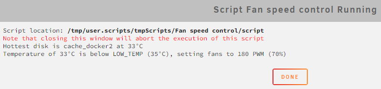
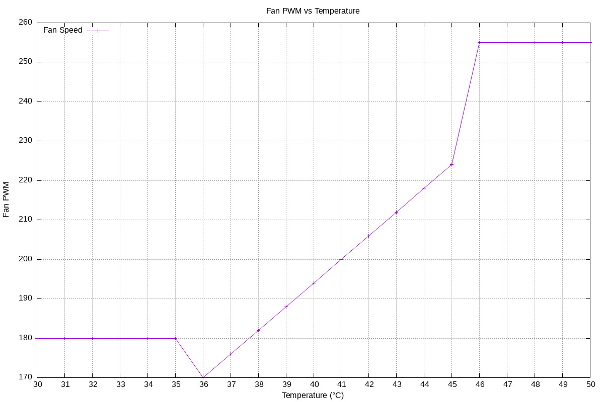

<div align="center">
  
</div>


# Unraid Fan Control Script
This Bash script enables automatic adjustment of fan speed in Unraid based on the temperature of your hard drives in the array. You can customize the disks to include or exclude, as well as adjust temperature settings for different fan control scenarios.





## Prerequisites

Before using this script, make sure you have completed the following steps:

1. Enable Manual Fan Speed Control in Unraid:
Edit the "/boot/syslinux/syslinux.cfg" file and change the line:
```
append initrd=/bzroot
```
to:
```
append initrd=/bzroot acpi_enforce_resources=lax
```
2. Set BIOS Settings:
Set the PWM headers you want to control to 100%/255 and mode to PWM in your BIOS.

(Optional) I recommend installing the `Dynamix System Temperature` plugin to easily monitor your fans' speed on the dashboard.


## Identify fan headers
* To identify fan headers, use the command `sensors -uA`.
* Utilize `pwmconfig` to find the correct fan header.
* Test PWM pins from the terminal using attributes like pwm[1-5], pwm[1-5]_enable, and pwm[1-5]_mode.


## Usage:

Utilize the `User Scripts` plugin to set up a new script.

* Name: Fan Control Script
* Description: Automatically adjust fan speed based on array temperature.
* Schedule: Custom -> `*/5 * * * *`
* Script: Contents of fan_speed_control.sh

The script dynamically optimizes fan speed based on disk temperatures, executing this process every 5 minutes. When manually executed, it offers informative messages about the current state and the actions taken. In case of unexpected conditions, it sets the fan speed to the maximum.


# Configuration

Adjust these parameters to suit your preferences. All configurable options are listed at the top of the script.


# Graph the Fan Curve



To generate a graphical representation of the fan curve, use the following command to create an image that plots temperature against PWM value. Note that `gnuplot` must be installed, which is not available on UnRAID, so run this command from another Linux machine:

```
./fan_speed_control.sh --generate-graph-data --output-file fan_speed_graph.png
```


## Inter-tech/Norco Case Owners
I suggest reviewing this informative blog post: [The mysterious 6-pin fan header on my Inter-Tech server cases](https://blog.cavelab.dev/2021/03/inter-tech-case-fan-header/). It provides valuable insights into effectively controlling the three large array fans.


### Feel free to contribute, report issues, or suggest improvements! If you find this repository useful, don't forget to star it :)

<a href="https://www.paypal.com/cgi-bin/webscr?cmd=_s-xclick&hosted_button_id=JPGHGTWP33A5L">
  
</a>
